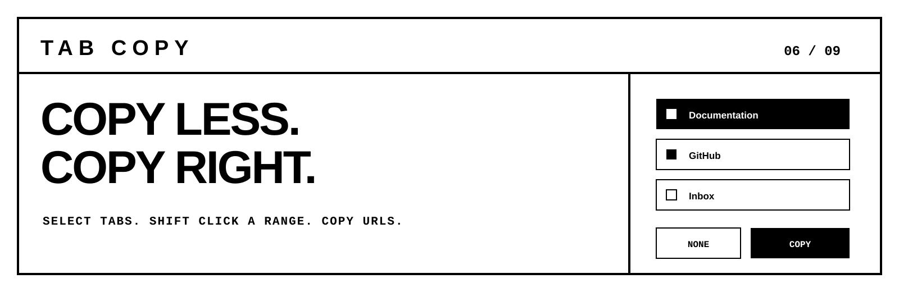
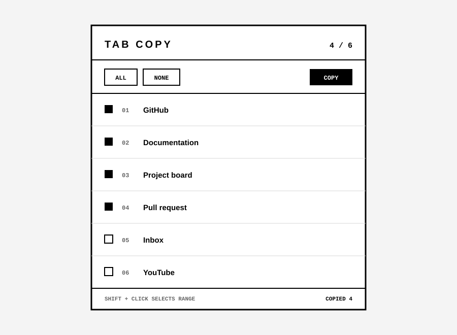

<p align="center">
  
</p>

<p align="center">
  
  
  
  
</p>

<p align="center">
  Select individual browser tabs or a continuous range, then copy their URLs in the correct order.
</p>

## Features

- Select individual tabs with a click.
- Select a continuous range with `Shift + Click`.
- Select all tabs or clear the selection instantly.
- Copy one URL per line in the original tab order.
- Minimal black and white interface.
- No analytics, tracking, accounts, storage, or network requests.
- Works in Chromium browsers that support Manifest V3, including Chrome and Edge.

<p align="center">
  
</p>

## Install from source

### Chrome

1. Download or clone this repository.
2. Open `chrome://extensions`.
3. Enable **Developer mode**.
4. Click **Load unpacked**.
5. Select the repository folder containing `manifest.json`.
6. Pin **Tab Copy** from the extensions menu.

### Microsoft Edge

1. Download or clone this repository.
2. Open `edge://extensions`.
3. Enable **Developer mode**.
4. Click **Load unpacked**.
5. Select the repository folder containing `manifest.json`.
6. Pin **Tab Copy** from the extensions menu.

## Usage

1. Open the extension popup.
2. Click tabs to select or deselect them.
3. To select a range, click the first tab, hold `Shift`, then click the last tab.
4. Click **COPY**.
5. Paste the URLs anywhere. Each URL is placed on its own line.

## Permissions

| Permission | Why it is required |
| --- | --- |
| `tabs` | Reads the title and URL of tabs in the current browser window. |
| `clipboardWrite` | Copies selected URLs after the user clicks **COPY**. |

The extension does not send data anywhere and does not store browsing data.

## Development

The project uses plain HTML, CSS, and JavaScript. There is no build step and no runtime dependency.

```bash
npm test
```

Tests use the test runner built into Node.js.

## Project structure

```text
.
├── .github/workflows/test.yml
├── assets/
│   ├── banner.svg
│   └── preview.svg
├── icons/
├── tests/logic.test.js
├── LICENSE
├── manifest.json
├── logic.js
├── popup.css
├── popup.html
└── popup.js
```

## Privacy

Tab Copy works entirely inside the browser. It has no backend, telemetry, analytics, advertisements, or remote code.

## Contributing

Small, focused pull requests are welcome. Read [CONTRIBUTING.md](CONTRIBUTING.md) before submitting changes.

## License

Licensed under the [MIT License](LICENSE).
